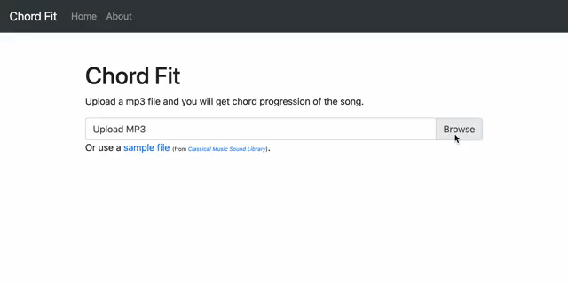

# Web Application to Analyze Chord Progression of Songs



## How to test on local
- Set up Ubuntu 18.04
- `sudo apt install python3 python3-pip libsndfile-dev ffmpeg`

```
git clone <this repository>
pip3 install --requirement src/requirements.txt
cd src && python -m gunicorn application:application
```

See http://127.0.0.1:8000/ and upload a MP3 file.

Note that current dependencies do not support Python >= 3.11.


## References
- [Fujishima, Takuya. Realtime Chord Recognition of Musical Sound: a System Using Common Lisp Music.](https://quod.lib.umich.edu/i/icmc/bbp2372.1999.446/--realtime-chord-recognition-of-musical-sound-a-system-using)
    - The approach which this utilize to recognize chords from music.
- [特開2000-298475](https://www.j-platpat.inpit.go.jp/c1800/PU/JP-2000-298475/DE702924E886509630C4BE1EC170643D2703BCAF24666387BCAF978160C604E0/11/ja)
    - Related patent in Japan, which seems expired.
